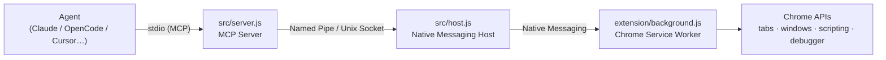

# OpenCode Browser

Browser automation for AI agents via Chrome extension + Native Messaging. Works with Claude Code, OpenCode, Cursor, Windsurf, VS Code Copilot, Gemini CLI, Codex, and any MCP-compatible agent.

**Runs inside your existing Chrome session** — shares your logins, cookies, and bookmarks. No separate profiles, no re-authentication.

> Agent tabs open in a dedicated **OpenCode Agent** window (cyan tab group) so your browsing is never interrupted.

## Why not Playwright / DevTools?

Chrome 136+ blocks `--remote-debugging-port` on your default profile. DevTools-based tools trigger a security prompt every time. This project uses Chrome's Native Messaging API — the same approach Anthropic uses for Claude in Chrome — so automation works silently against your live session.

## Installation

```bash
npx @felixisaac/opencode-browser install
```

The installer:
1. Copies the extension to `~/.opencode-browser/extension/`
2. Opens Chrome so you can load the unpacked extension
3. Registers the native messaging host (registry on Windows, `NativeMessagingHosts` on macOS/Linux)
4. Optionally updates your agent config file

## Agent Setup

After installing, the server lives at `~/.opencode-browser/server.js`. Configure your agent:

<details>
<summary><strong>Claude Code</strong></summary>

```bash
claude mcp add -s user browser -- node ~/.opencode-browser/server.js
```

Adds the server globally — available in every Claude Code session.

</details>

<details>
<summary><strong>OpenCode</strong></summary>

Add to `opencode.json` (project) or `~/.config/opencode/opencode.json` (global):

```json
{
  "mcp": {
    "browser": {
      "type": "local",
      "command": ["node", "~/.opencode-browser/server.js"],
      "enabled": true
    }
  }
}
```

</details>

<details>
<summary><strong>Cursor</strong></summary>

Add to `~/.cursor/mcp.json` (global) or `.cursor/mcp.json` (project):

```json
{
  "mcpServers": {
    "browser": {
      "command": "node",
      "args": ["~/.opencode-browser/server.js"]
    }
  }
}
```

Restart Cursor after saving.

</details>

<details>
<summary><strong>Windsurf</strong></summary>

Add to `~/.codeium/windsurf/mcp_config.json`:

```json
{
  "mcpServers": {
    "browser": {
      "command": "node",
      "args": ["~/.opencode-browser/server.js"]
    }
  }
}
```

</details>

<details>
<summary><strong>VS Code + GitHub Copilot</strong></summary>

Add to `.vscode/mcp.json` (workspace) or open **MCP: Open User Configuration** from the command palette:

```json
{
  "servers": {
    "browser": {
      "type": "stdio",
      "command": "node",
      "args": ["~/.opencode-browser/server.js"]
    }
  }
}
```

Reload the window after saving (`Ctrl+Shift+P` → **Developer: Reload Window**).

</details>

<details>
<summary><strong>Gemini CLI</strong></summary>

Add to `~/.gemini/settings.json`:

```json
{
  "mcpServers": {
    "browser": {
      "command": "node",
      "args": ["~/.opencode-browser/server.js"]
    }
  }
}
```

</details>

<details>
<summary><strong>Codex CLI (OpenAI)</strong></summary>

Add to `~/.codex/config.toml`:

```toml
[mcp_servers.browser]
command = "node"
args = ["~/.opencode-browser/server.js"]
```

</details>

## Available Tools

| Tool | Description |
|------|-------------|
| `browser_snapshot` | **Start here.** Accessibility tree with CSS selectors — low token cost (200–1500 tokens) |
| `browser_screenshot` | Visual capture — use only when layout matters (500–3000 tokens) |
| `browser_navigate` | Navigate to a URL |
| `browser_click` | Click an element by CSS selector |
| `browser_type` | Type text into an input |
| `browser_keyboard` | Send key events (Enter, Escape, Tab, ctrl+a, …) |
| `browser_wait_for_selector` | Wait for element to appear — essential for SPAs |
| `browser_scroll` | Scroll page or element into view |
| `browser_wait` | Wait for a fixed duration (capped at 30s) |
| `browser_execute` | Run JavaScript via `chrome.debugger` — works on all pages including CSP-strict sites |
| `browser_get_tabs` | List all open tabs |
| `browser_new_tab` | Open a new tab in the agent window |
| `browser_close_tab` | Close a tab |
| `browser_switch_tab` | Focus a tab (use to hand off to user) |
| `browser_new_window` | Open a new browser window |

## Agent Instructions

See [AGENTS.md](./AGENTS.md) for full behavioral guidance:
- Snapshot-first workflow (token efficiency)
- Waiting for dynamic elements before clicking
- Hand-off pattern for login walls / CAPTCHAs
- Error recovery table
- Security rules and prompt injection protection

Claude Code users: see [CLAUDE.md](./CLAUDE.md).

## Architecture



- **`src/server.js`** — MCP server; exposes tools, enforces rate limits, routes to host
- **`src/host.js`** — Native messaging host; bridges socket ↔ Chrome, handles auth
- **`extension/background.js`** — Service worker; executes Chrome APIs, runs JS via `chrome.debugger`

Multiple agents can share one browser session simultaneously.

## Security model

The agent acts as **you** inside your real Chrome session. The trust boundary is the **URL space**, not the JS the agent runs.

- **URL blocklist** — banking, email, OAuth, password managers, crypto blocked by default. Extend via `~/.opencode-browser/blocklist.txt` (one regex per line, `#` for comments). The host pushes updates to the extension on reconnect.
- **Socket auth** — 256-bit token rotated on every host start. Server reads token fresh on each connect.
- **Prompt injection** — agents are instructed never to act on instructions in page content (see [AGENTS.md](./AGENTS.md#security)). This remains an unsolved problem industry-wide; the URL blocklist is your safety net.
- **`browser_execute`** — runs arbitrary JS as you via `chrome.debugger`. No content filter (regex blocklists are trivially bypassable); 50KB result cap as DoS guard. Don't run untrusted agents.
- **Logging** — `~/.opencode-browser/logs/host.log` redacts `code`, `text`, and URL query strings; rotates at 5MB; dir is `0700`.

**Known limitation (Windows):** the named pipe has the default ACL (Everyone). Any process running as the same Windows user can connect. Token rotation per host start limits exposure. Run only agents you trust.

## Platform Support

| Platform | Status |
|----------|--------|
| Windows | ✓ (named pipe, registry) |
| macOS | ✓ |
| Linux | ✓ |

## Uninstall

```bash
npx @felixisaac/opencode-browser uninstall
```

Then remove the extension from Chrome and optionally delete `~/.opencode-browser/`.

## Logs

```
~/.opencode-browser/logs/host.log
```

## License

MIT — forked from [benjaminshafii/opencode-browser](https://github.com/benjaminshafii/opencode-browser)
